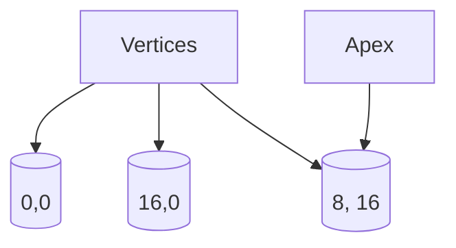

# Sierpinski Triangle Simulator

## How does it work?

During each iteration, we plot the midpoint between the previous point(starting with the apex) and a randomly chosen vertex. 

## Example

This is a simplified example of this process with a non-equilateral triangle in the first quadrant.

Let's say it has a width and a height of 16 units.

The first point is the apex.

Last Point | Chosen vertex | Mid-point
--- | --- | ---
(8,16) | (0,0)  | (4,8) 
(4,8)  | (16,0) | (10,4) 
(10,4) | (8,16) | (9,10) 

As we add more points using this process, a Sierpinski Triangle forms.